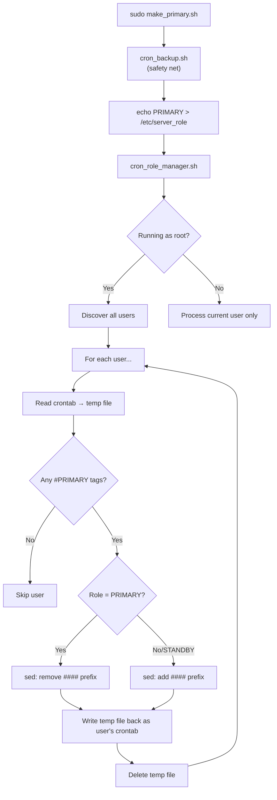

# Crontab Editing Internals — Linux vs AIX

This document explains exactly **how** the cron job manager reads, modifies, and writes crontabs on each platform, and **why** the approaches differ.

---

## Platform Architecture Overview

```
┌─────────────────────────────────────────────────────────────────────┐
│                       make_primary.sh / make_standby.sh            │
│                    (orchestrator — sets role, calls manager)        │
└──────────────────────────────┬──────────────────────────────────────┘
                               │ calls
                               ▼
┌─────────────────────────────────────────────────────────────────────┐
│                       cron_role_manager.sh                         │
│                  (core engine — reads, transforms, writes)         │
│                                                                     │
│   ┌──────────────┐    ┌──────────────┐    ┌──────────────────┐     │
│   │ 1. DISCOVER  │───▶│ 2. READ      │───▶│ 3. TRANSFORM     │     │
│   │    users     │    │    crontab   │    │    (sed)          │     │
│   └──────────────┘    └──────────────┘    └────────┬─────────┘     │
│                                                     │               │
│                                            ┌────────▼─────────┐    │
│                                            │ 4. WRITE BACK    │    │
│                                            │    crontab       │    │
│                                            └──────────────────┘    │
└─────────────────────────────────────────────────────────────────────┘
```

Each of these four stages works differently on Linux and AIX. The sections below detail each stage.

---

## Stage 1: User Discovery

The scripts need to find all users who might have crontabs.

### Linux

```bash
# linux/cron_role_manager.sh — get_valid_users()
awk -F: '$7 !~ /nologin|false|sync|halt|shutdown/ && $3 >= 0 { print $1 }' /etc/passwd
```

**How it works:**
- Parses `/etc/passwd` directly
- Filters out system/service accounts by checking the login shell (field 7)
- Excludes shells like `/sbin/nologin`, `/bin/false`, `sync`, `halt`, `shutdown`
- Requires UID ≥ 0 (includes root)
- This is a **best-guess approach** — some users in the list may have no crontab at all

### AIX

```bash
# aix/cron_role_manager.sh — get_spool_users()
spool_dir="/var/spool/cron/crontabs"
if [ -d "$spool_dir" ] && [ -r "$spool_dir" ]; then
    for f in "$spool_dir"/*; do
        [ -e "$f" ] || continue
        [ -f "$f" ] || continue
        fname=$(basename "$f")
        case "$fname" in
            .*|*~|*.bak) continue ;;   # skip hidden/backup files
        esac
        echo "$fname"
    done
else
    # Fallback: parse /etc/passwd (same as Linux)
    awk -F: '$7 !~ /nologin|false|sync|halt|shutdown/ && $3 >= 0 { print $1 }' /etc/passwd
fi
```

**How it works:**
- **Primary method:** Enumerates files in `/var/spool/cron/crontabs/`
  - On AIX, each user's crontab is stored as a file named after the username (e.g., `/var/spool/cron/crontabs/oracle`)
  - This gives an **exact list** of users who actually have crontabs — no guessing
  - Skips hidden files (`.`), backup files (`~`, `.bak`)
- **Fallback:** If the spool directory is unreadable, falls back to `/etc/passwd` parsing (same as Linux)

### Why the difference?

| Aspect | Linux | AIX |
|--------|-------|-----|
| Crontab storage | `/var/spool/cron/crontabs/` (often restricted) | `/var/spool/cron/crontabs/` (readable by root) |
| Discovery method | `/etc/passwd` filtering | Spool directory enumeration |
| Accuracy | Lists ALL valid-shell users (many may have no crontab) | Lists ONLY users who have a crontab file |
| Why this approach? | Linux spool dir often has restrictive permissions even for root in some distributions | AIX spool dir is reliably accessible to root |

---

## Stage 2: Reading a User's Crontab

### Linux

```bash
# linux/cron_role_manager.sh — process_user()
crontab -u "$target_user" -l > "$user_tmpfile" 2>/dev/null
```

**Single command.** The `-u` flag lets root read any user's crontab directly.

**Syntax:** `crontab -u <username> -l`

### AIX

```bash
# aix/cron_role_manager.sh — process_user()
if [ "$(id -un)" = "$target_user" ]; then
    crontab -l > "$user_tmpfile" 2>/dev/null
else
    crontab -l "$target_user" > "$user_tmpfile" 2>/dev/null
fi
```

**Two code paths.** AIX's `crontab` command does NOT support the `-u` flag.

| Scenario | Linux command | AIX command |
|----------|--------------|-------------|
| Read own crontab | `crontab -l` | `crontab -l` |
| Read another user's crontab (as root) | `crontab -u oracle -l` | `crontab -l oracle` |

**Key difference:** On AIX, the username is a **positional argument** after `-l`, not a named `-u` parameter. The `id -un` check determines whether to pass the username.

> **Same pattern in backup scripts:**
> - Linux: `crontab -u "$USER" -l`
> - AIX: `crontab -l "$USER"` (for other users) or `crontab -l` (for self)

---

## Stage 3: Transforming the Crontab (sed)

This stage is **identical on both platforms**. The crontab content is already in a temp file, and `sed` is used to toggle lines.

### The Tag Convention

Every cron line ends with a tag comment:

```cron
0 2 * * * /scripts/backup.sh       #PRIMARY    ← managed by this tool
*/5 * * * * /scripts/health.sh     #ALWAYS     ← never touched
```

### The Regex Pattern

```bash
P_TAG="#[Pp][Rr][Ii][Mm][Aa][Rr][Yy]"
```

This is a **case-insensitive character-class pattern** that matches `#PRIMARY`, `#Primary`, `#primary`, etc. Used instead of `grep -i` because `sed` address patterns don't support `-i` flags.

### Making PRIMARY (enable jobs)

When the server becomes PRIMARY, disabled `#PRIMARY` lines need to be **un-commented**:

```bash
# Count lines that need enabling (start with ####)
WILL_CHANGE=$(grep -c "^####.*${P_TAG}" "$user_tmpfile")

# Remove the #### prefix from matching lines
sed "/^####.*${P_TAG}/ s/^####//" "$user_tmpfile" > "${user_tmpfile}.new"
mv "${user_tmpfile}.new" "$user_tmpfile"
```

**Before:**
```
####0 2 * * * /scripts/backup.sh  #PRIMARY
####0 6 * * 1 /scripts/report.sh  #PRIMARY
*/5 * * * * /scripts/health.sh    #ALWAYS
```

**After:**
```
0 2 * * * /scripts/backup.sh  #PRIMARY
0 6 * * 1 /scripts/report.sh  #PRIMARY
*/5 * * * * /scripts/health.sh    #ALWAYS
```

### Making STANDBY (disable jobs)

When the server becomes STANDBY, active `#PRIMARY` lines need to be **commented out**:

```bash
# Count lines that need disabling (start with non-# character)
WILL_CHANGE=$(grep -c "^[^#].*${P_TAG}" "$user_tmpfile")

# Add #### prefix to matching lines
sed "/^[^#].*${P_TAG}/ s/^/####/" "$user_tmpfile" > "${user_tmpfile}.new"
mv "${user_tmpfile}.new" "$user_tmpfile"
```

**Before:**
```
0 2 * * * /scripts/backup.sh  #PRIMARY
0 6 * * 1 /scripts/report.sh  #PRIMARY
*/5 * * * * /scripts/health.sh    #ALWAYS
```

**After:**
```
####0 2 * * * /scripts/backup.sh  #PRIMARY
####0 6 * * 1 /scripts/report.sh  #PRIMARY
*/5 * * * * /scripts/health.sh    #ALWAYS
```

### Why `sed > file.new && mv` instead of `sed -i`?

```bash
# ❌ This does NOT work on AIX:
sed -i "/pattern/ s/^####//" "$file"

# ✅ Portable approach (works on both Linux and AIX):
sed "/pattern/ s/^####//" "$file" > "${file}.new"
mv "${file}.new" "$file"
```

AIX does not support `sed -i` (in-place editing). The portable `sed + redirect + mv` approach is used in **both** the Linux and AIX versions for consistency.

### Regex Breakdown

```
sed "/^####.*${P_TAG}/ s/^####//"
     ├────────────────┘ ├────────┘
     │                  └── Substitution: remove "####" from start
     └── Address: only match lines starting with "####" AND containing #PRIMARY
```

```
sed "/^[^#].*${P_TAG}/ s/^/####/"
     ├────────────────┘ ├────────┘
     │                  └── Substitution: prepend "####" at start
     └── Address: only match lines NOT starting with "#" AND containing #PRIMARY
```

The `^[^#]` pattern ensures:
- Lines already disabled (`####...`) are not double-commented
- Pure comment lines (`# description`) are not accidentally commented
- `#ALWAYS` lines are never matched (they don't contain `#PRIMARY`)

---

## Stage 4: Writing the Crontab Back

This is where the platforms differ the most.

### Linux

```bash
# linux/cron_role_manager.sh — apply crontab
crontab -u "$target_user" "$user_tmpfile"
```

**Single command.** Root uses `-u` to install the temp file as any user's crontab.

**Syntax:** `crontab -u <username> <file>`

### AIX

```bash
# aix/cron_role_manager.sh — apply crontab
chown "$target_user" "$user_tmpfile"              # Step 1: fix ownership

if [ "$(id -un)" = "$target_user" ]; then
    crontab "$user_tmpfile"                        # Step 2a: install as self
else
    su "$target_user" -c "crontab $user_tmpfile"   # Step 2b: install as other user
fi
```

**Three-step process:**

| Step | What | Why |
|------|------|-----|
| `chown` | Change temp file ownership to target user | AIX cron daemon validates file ownership |
| `id -un` check | Determine if we ARE the target user | Different command needed for self vs others |
| `su user -c "crontab file"` | Run crontab as the target user | AIX has no `-u` flag — must literally become the user |

> **Important:** `su` is used **without** the `-` (dash) flag. Using `su - user` would invoke a login shell and execute `.profile` scripts, which could produce unexpected output or side effects.

### Side-by-side Comparison

| Operation | Linux | AIX |
|-----------|-------|-----|
| Install own crontab | `crontab file` | `crontab file` |
| Install other user's crontab | `crontab -u oracle file` | `chown oracle file && su oracle -c "crontab file"` |
| Ownership handling | Not needed (root -u handles it) | Must `chown` before `su` |
| Shell used | bash | ksh |

### The Same Pattern in Restore Scripts

The restore scripts follow the exact same pattern:

**Linux (`cron_restore.sh`):**
```bash
crontab -u "$USER" "$CRON_FILE"
```

**AIX (`cron_restore.sh`):**
```bash
chown "$USER" "$CRON_FILE"
if [ "$(id -un)" = "$USER" ]; then
    crontab "$CRON_FILE"
else
    su "$USER" -c "crontab $CRON_FILE"
fi
```

---

## Complete Flow: End-to-End Example

### Scenario: DR server becomes PRIMARY

```
Admin runs:  sudo ./make_primary.sh
```



### Linux execution trace

```
1. crontab -u oracle -l > /tmp/crontab_mgr_12345_oracle   ← read
2. grep "^####.*#PRIMARY" /tmp/...                          ← check
3. sed "/^####.*#PRIMARY/ s/^####//" ... > ...new           ← transform
4. mv ...new /tmp/crontab_mgr_12345_oracle                  ← replace temp
5. crontab -u oracle /tmp/crontab_mgr_12345_oracle          ← write back
6. rm -f /tmp/crontab_mgr_12345_oracle                      ← cleanup
```

### AIX execution trace

```
1. crontab -l oracle > /tmp/crontab_mgr_12345_oracle       ← read (positional)
2. grep "^####.*#PRIMARY" /tmp/...                          ← check
3. sed "/^####.*#PRIMARY/ s/^####//" ... > ...new           ← transform
4. mv ...new /tmp/crontab_mgr_12345_oracle                  ← replace temp
5. chown oracle /tmp/crontab_mgr_12345_oracle               ← fix ownership
6. su oracle -c "crontab /tmp/crontab_mgr_12345_oracle"     ← write back via su
7. rm -f /tmp/crontab_mgr_12345_oracle                      ← cleanup
```

---

## Shell Compatibility Reference

| Feature | Linux scripts | AIX scripts |
|---------|--------------|-------------|
| Shebang | `#!/bin/bash` | `#!/usr/bin/ksh` |
| `local` keyword | ✅ Supported | ❌ Not in ksh — use plain variables |
| `$(whoami)` | ✅ Available | ⚠️ Use `$(id -un)` instead |
| `sed -i` | ✅ Available | ❌ Not supported |
| `crontab -u` | ✅ Available | ❌ Not supported |
| `[[ ]]` | ✅ Available | ✅ Available in ksh93 |
| `$(( ))` arithmetic | ✅ Available | ✅ Available |
| Process substitution `<()` | ✅ Available | ❌ Not in all ksh versions |

---

## Temp File Safety

Both platforms use the same temp file strategy:

```bash
TMPFILE="/tmp/crontab_mgr_$$.txt"                          # $$ = current PID
user_tmpfile="${TMPFILE}_${target_user}"                     # per-user temp file
trap 'rm -f "${TMPFILE}"*; exit 1' INT TERM HUP             # cleanup on signals
```

- **`$$` (PID)** ensures unique filenames even with concurrent runs
- **Signal trap** ensures temp files are cleaned up if the script is killed
- **Final cleanup** (`rm -f "${TMPFILE}"*`) catches any remaining temp files after the loop
